# SWEaters United (Team 02)

> "A team that sweats together sticks together"

## Our Name
*"SWEaters United"* represents our great group of hard working and well-coordinated software engineers (SWEs).

## Our Logo

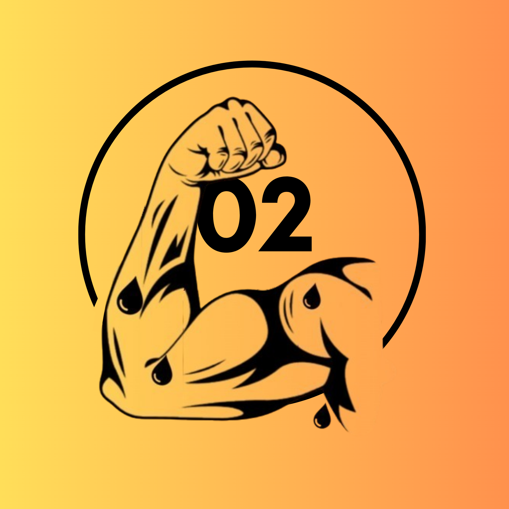

## Branding

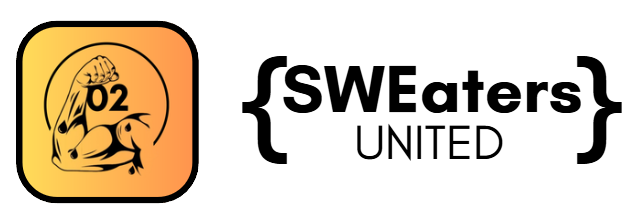

### Mascot

Our mascot is a heroic SWEat figure. This figure always has one flexed arm, matching our logo, in which sweat droplets fly off that reflect their sparks of effort. The arm symbolizes strength and unity while the droplets symbolize hustle and the "sweat = try-hard" mindset.

### Team Color Palette

| Swatch | Color Name | Hex | Usage |
| :---: | --- | --- | --- |
|  | SWEat Orange | `#FF914D` | Primary accent |
|  | Power Black | `#000000` | Primary text and outlines |

## Our Team Values

- Availability and Reachability
- Accountability
- Effort
- Focus on Priorities
- Open-Mindedness

## Team Roster

| Photo | Name | Overview | GitHub Website |
| :---: | --- | --- | --- |
| 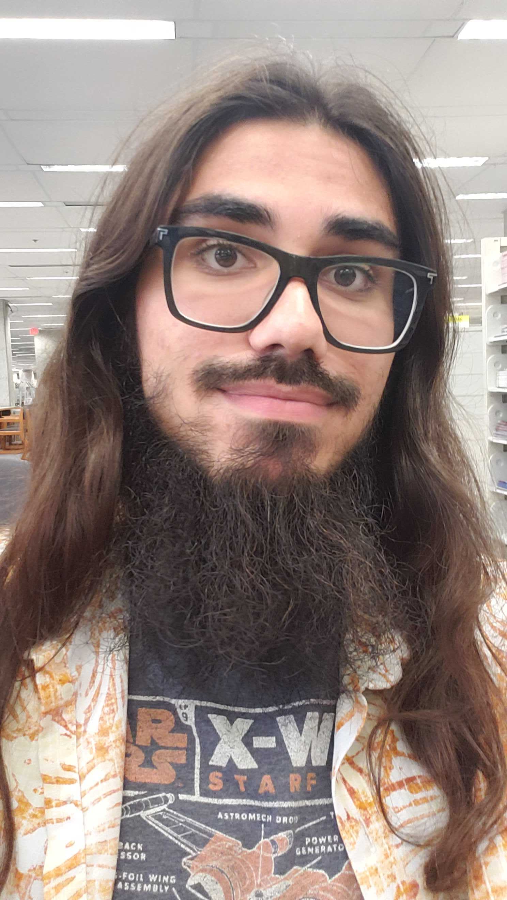 | Abdurrahman Syed | 3rd year CS major. Experience in multiple programming languages. Background in Indie Game Design and Development. | [Website](https://tobbytukaywan.github.io/) |
| 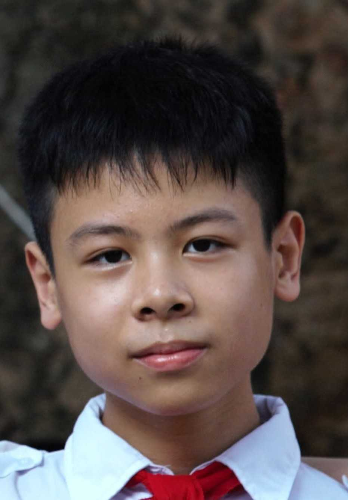 | Andrew Le | 3rd year CS major. Has interests in ML and Software Engineering. Adapts and learns fast. Hobbies include Piano, Reading, and Idle Gaming. | [Website](https://andrewle0427.github.io/AndrewLe_CSE110/) |
| 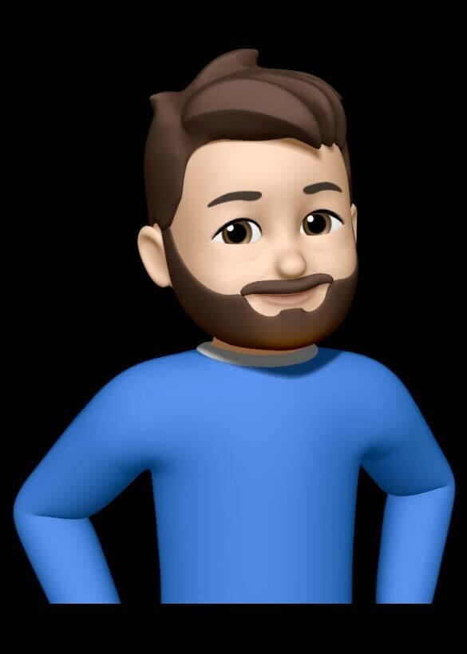 | Andre Stransky | Senior and Math-CS major. Has strong experience with several programming languages. Is interested in High Performance Computing, Full-Stack Security, Signal Processing, ML, and frontend interaction engineering. Hobbies include reading and development.  | [Website](https://2astar6.github.io/c110-sp26-lab1/) |
| 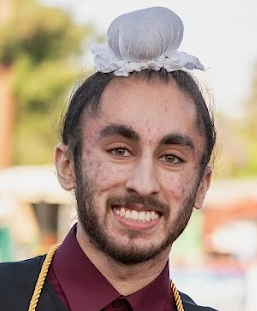 | Gurnoor Bola | 3rd year CS major. Has interests in High Performance Computing, Graphics, Systems Programming. Hobbies include Video Games, Basketball, Dooming. | [Website](https://gurnoorbola.github.io/profile/) |
|  | Jason Wang | 3rd year CS major. Has interests in Robotics, AI, and Soccer. | [Website](https://jsonwang.vercel.app/) |
| 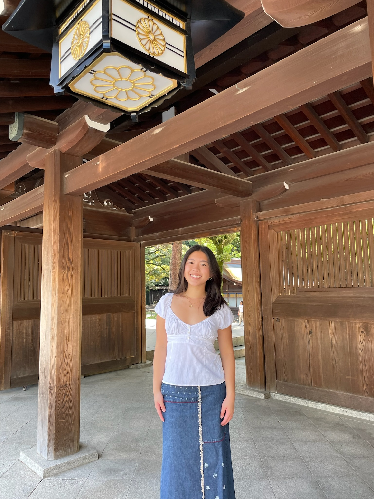 | Justine Le | Junior CS Major. Hobbies and interests include Playing Sports, Hiking, Reading, and Piano. | [Website](https://justinele19.github.io/justinele19/) |
| 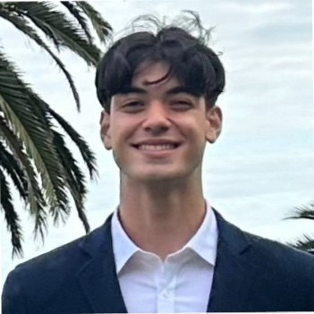 | Mani Schabani-Qassri | 3rd year Math-CS major with minor in Finance. Born in Mannheim Germany, moved to LA ~7 years ago. Most interested in backend development. Familiar with Python, Java, CSS. | [Website](https://glowone.github.io/cse110lab1/) |
| 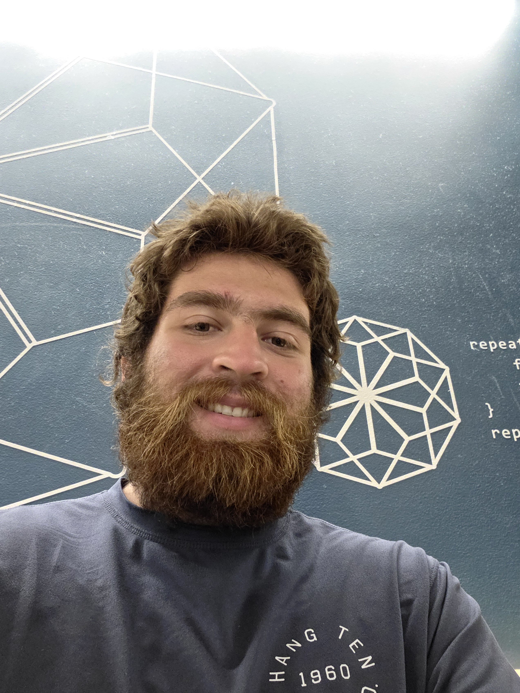 | Paul Montal | 3rd year CS major. Has interests in C++ Programming and Unity game developement. Hobbies include Weightlifting and Video Games (OG Fortnite, Smash, Wii). | [Website](https://paulm130.github.io/) |
| 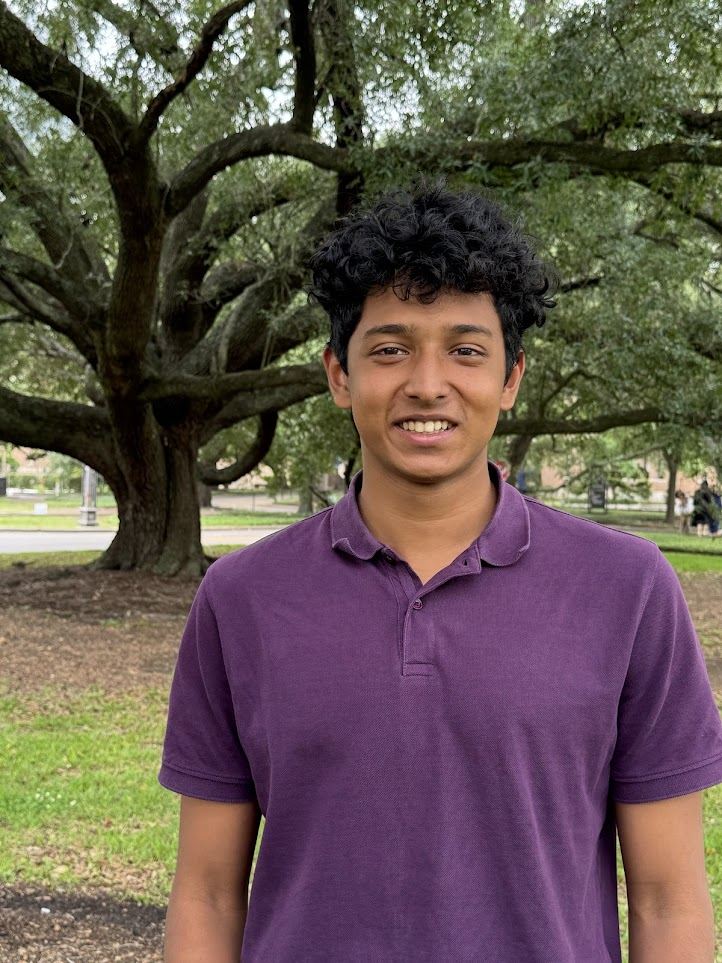 | Sahil Dalal | 2nd year CS major. Has interests in Table Tennis, Running, and Cooking. | [Website](https://dstyle294.github.io/CSE110_Lab1/#about-me) |
| 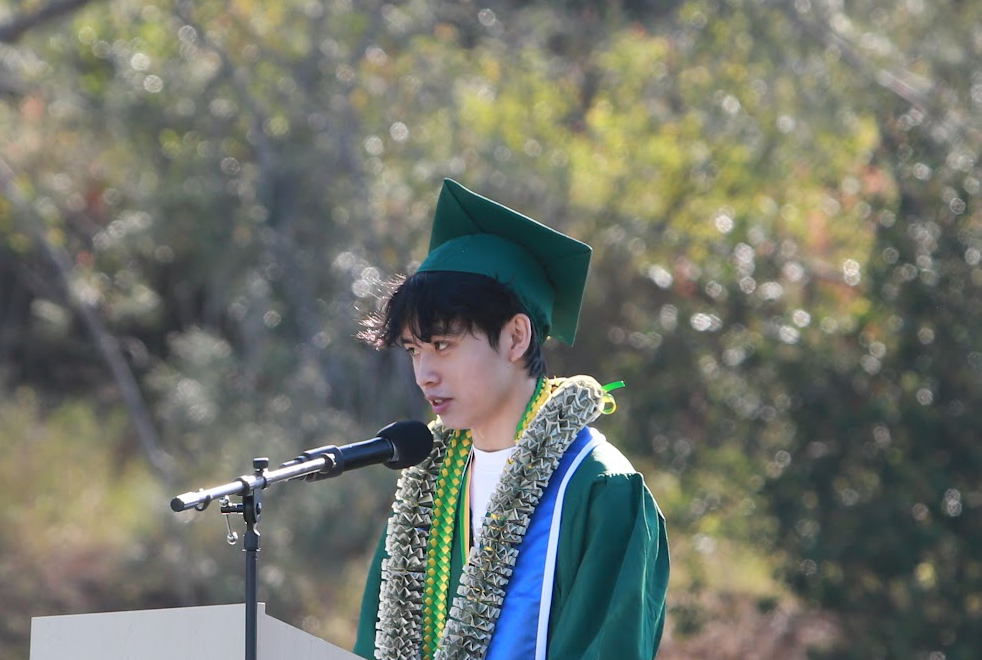 | Scott Pham | 2nd year CS major. Has interests in Programming, Mathematics, Traveling, and Art. Hobbies include weightlifting, reading, and trying new foods. | [Website](https://phamhscott.github.io/) |
| 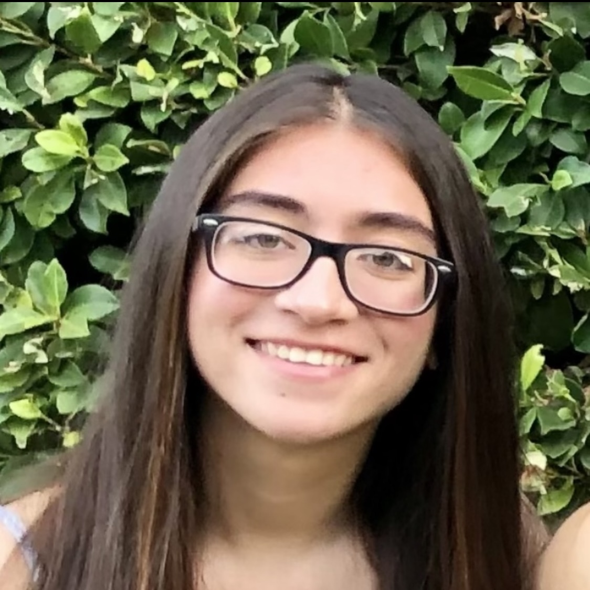 | Sophia Ali | 3rd year CS Major. Has interests in Programming and ML. Hobbies include Reading, Hiking, and Baking. Familiar with Python and C++. | [Website](https://sophiaa01.github.io/about-me/) |
